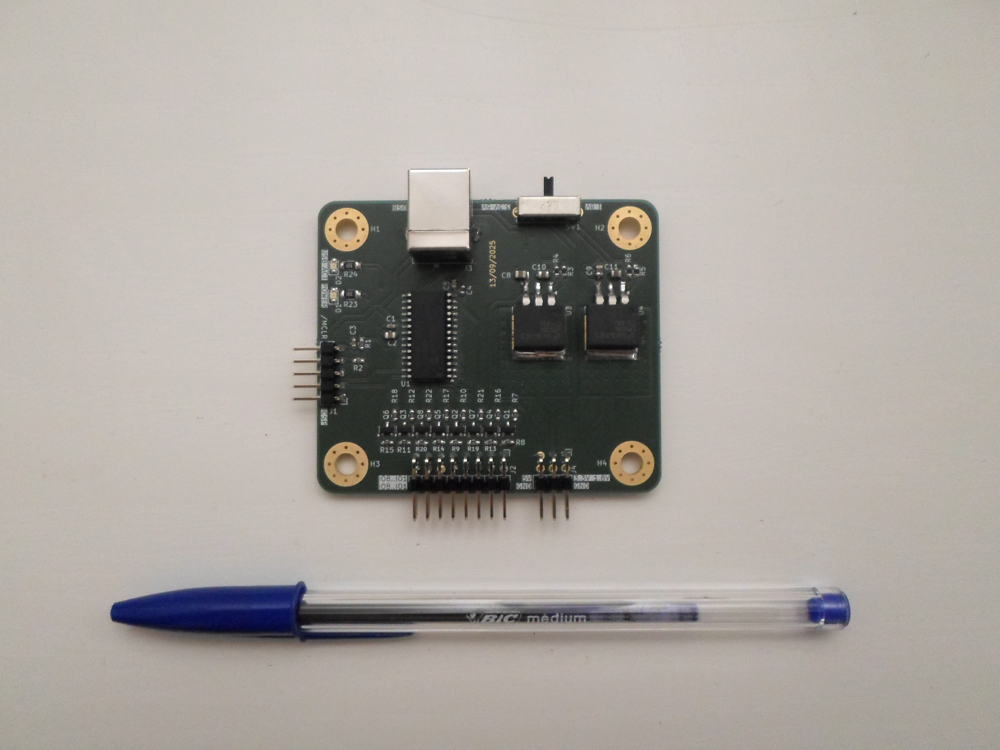

# Logic Signal Generator

A versatile multi-protocol 1.8V/3.3V/5V logic signal generator powered by a PIC18F25K50.

## Features

* 8 independant channels featuring several standard protocols.
* The microcontroller hardware I2C, UART, SPI and PWM modules are used to provide the signal timings.
* Entirely USB-powered, no need for an external power supply.
* Dedicated power supplies and ground connector to easily power the device under test. The embedded 1.8V and 3.3V power supplies are each able to provide 500mA (these power supplies are derived from the USB power, so the available power could be limited by the USB port).
* On-board switch to quickly select the logic signals output voltage (1.8V, 3.3V or 5V).
* The USB interface is managed by the microcontroller itself and provides a standard USB serial port to the host.
* Simple shell-based text interface through the serial port to interactively configure and define the logic signals to generate.
* The signals are doubled on the output connector to easily connect a logic analyzer.
* PICkit-compatible standard connector to easily program the on-board microcontroller firmware.
* Compact and robust casing designed to bring the signal generator on field.

## Hardware

Bare PCB :

Assembled PCB :

